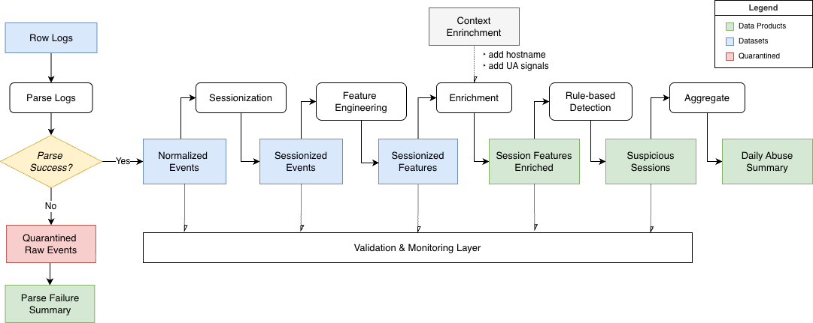

# From Behavior to Interpretation: An Explainable Bot Detection Pipeline


## 1. What this project does
This project builds **a replayable anti-scraping analysis pipelin**e that transforms raw web access logs into explainable, session-level detection outputs.

It identifies suspicious traffic using behavioral signals, while preserving full traceability back to request-level events. 
In addition to detection outputs, the pipeline also produces a reusable session-level feature dataset for downstream analysis and model development.

### TL;DR 🤓

- Builds a reliable data pipeline to detect suspicious web traffic using session-level behavioral signals  
- Preserves full traceability from detection results back to raw request events  
- Separates detection (behavior) from interpretation (context) to improve explainability  
- Produces both analyst-facing detection outputs and ML-ready feature datasets  


## 2. Why this problem is hard

Detecting scraping behavior from web logs is difficult because legitimate crawlers and malicious scrapers often exhibit similar patterns.

Both can generate:

- high request rates  
- systematic navigation across many paths  
- missing referer signals  

As a result, behavior-based detection can identify automated activity, but cannot reliably distinguish between benign and malicious intent.
This creates a gap between detection and interpretation, where behavior alone is insufficient to understand flagged traffic.


## 3. What this pipeline produces

This pipeline produces two types of data products designed for different consumers.

### 1. Detection product (primary)

The primary output is an explainable detection dataset for analysts and operational monitoring.

It answers:

- Which sessions are suspicious?  
- Why were they flagged?  
- How should they be interpreted?  

The main dataset, `suspicious_sessions`, provides:

- session-level risk scores and risk bands  
- rule-based signals explaining why a session was flagged  
- contextual annotations to aid interpretation  

These outputs enable analysts to investigate suspicious traffic, identify false positives, and distinguish between likely benign crawlers and unknown automation.


### 2. Feature product (secondary)

The pipeline also produces a session-level feature dataset (`session_features`) for downstream analysis and model development.

This dataset provides:

- behavioral signals derived from session activity  
- minimal contextual features  

It serves as a reusable input for:

- training detection models  
- behavioral analysis and experimentation  


## 4. How it works

### Data
- `access.log`  
  Raw web access logs in Apache combined log format, containing request-level information such as IP, timestamp, request path, status code, referer, and user-agent.
  The dataset contains approximately 10 million requests across 5 days (2019-01-22 to 2019-01-26).

- `ip_hostname_lookup.csv`  
  A lookup table mapping IP addresses to hostnames, used for lightweight context enrichment.

The access logs serve as the primary input for behavioral analysis, while the hostname mapping provides additional signals for interpreting detected traffic.

### Data flow




### Layers

#### Core transformations

- **Raw Logs**  
  Immutable, append-only source data for incoming web traffic.  
  Malformed or unparseable lines are isolated early and stored separately for inspection.

- **Normalized Events (request-level)**  
  Structured request records extracted from raw logs without applying detection logic.  
  This layer standardizes core fields and applies path templating to generalize dynamic URLs into reusable patterns.

- **Sessionized Events (event-level)**  
  Request-level records augmented with a `session_id`, derived from `(src_ip, user_agent)` and an inactivity threshold.  
  A lookback window from the previous day is included to preserve session boundaries across partitions.

- **Session Features (session-level)**  
  Aggregated behavioral features computed at the session grain.  
  This layer converts event-level activity into a model-ready session representation.

#### Data products

- **Session Features Enriched (session-level)**  
  Session-level features augmented with lightweight context signals derived from hostname lookup and user-agent patterns.  
  These signals are used for interpretation and are not part of the detection score itself.

- **Suspicious Sessions (session-level)**  
  Explainable detection output produced by rule-based scoring over behavioral features.  
  Each session is assigned a `risk_band`, with contextual signals attached only as annotations.

- **Daily Abuse Summary (daily-level)**  
  Daily aggregate of suspicious activity for monitoring and reporting.  
  This layer summarizes traffic patterns and risk distribution at a higher level.
  

### Validation and Monitoring

The pipeline enforces data quality at every stage and records execution metadata for observability.

- **Core validation checks**  
  Row count consistency, grain consistency, duplicate detection, and null/range validation ensure that transformations preserve data integrity.

- **Execution behavior**  
  Error-level checks fail fast on critical issues, while warning-level checks surface non-blocking data quality concerns.

- **Quarantine handling**  
  Malformed or unparseable raw lines are isolated during parsing to prevent invalid data from propagating downstream.

- **Metrics and metadata**  
  Each run produces structured metrics (e.g., row counts, validation results, risk distributions) and runtime metadata (run_id, duration, status) for traceability and debugging.


### Execution model

The pipeline runs as a daily batch system driven by a `process_date`, producing partitioned outputs for each run.

- **Batch processing model**  
  Each run processes a single date or a date range, enabling reproducibility, backfill, and isolated reprocessing.

- **Partitioned outputs**  
  Outputs are written by date, allowing efficient filtering and replay without reprocessing the entire dataset.

- **Offline-first design**  
  While implemented as a batch pipeline, the system is designed around partitioned data, enabling extension to near real-time processing without changes to the core data model.
  
- **Environment-aware execution**  
  The same pipeline runs across environments (local and EC2) with configuration-driven behavior.  
  Local runs operate on sampled data to avoid memory constraints, while EC2 processes the full dataset.

- **Configuration-driven behavior**  
  Key aspects of the pipeline are controlled via configuration, including detection thresholds and sampling limits.  
  This allows the system to be tuned for different environments and data scales without modifying the core logic.


## 5. Results

### Q1. How do suspicious sessions differ from normal traffic?

**High-risk sessions exhibit bursty, machine-like behavior with near-zero inter-request gaps.**


- significantly higher request rates  
- near-zero inter-request gaps  
- less natural navigation patterns compared to benign sessions
  

### Q2. Where do known crawlers appear in the risk spectrum?

**Known crawler signals are concentrated in low-risk sessions, while high-risk sessions are dominated by unresolved traffic.**


- known_bot_candidate appears most frequently in the low-risk band  
- high-risk sessions are largely associated with unresolved host context  
- context signals help differentiate between recognizable crawlers and unknown automation  

Context signals are used only for interpretation and do not influence detection scores.


### Q3. What does a suspicious session actually look like?

**Suspicious sessions often show rapid, repetitive request patterns within short time windows.**


- burst of consecutive requests after initial navigation  
- repeated access to similar path templates (e.g., image endpoints)  
- extremely short inter-request gaps  

These patterns demonstrate how session-level signals map directly to request-level behavior, enabling traceability and inspection.


### Q4. Is suspicious activity concentrated among a small number of IPs?

**Suspicious activity is highly concentrated, with a small number of IPs generating a large share of flagged sessions.**


- most IPs generate only a few suspicious sessions  
- a small subset of IPs accounts for a disproportionate share  
- repeated automated behavior can often be traced to recurring actors  


## 6. Limitations

### 1. Behavior alone cannot determine intent

The detection logic is based on behavioral signals, which are effective at identifying automated activity but do not capture intent.

As a result, legitimate crawlers and potentially malicious scrapers can exhibit similar patterns, making it difficult to distinguish between them without additional context.

### 2. Context signals are incomplete and potentially unreliable

Context enrichment relies on hostname resolution and user-agent patterns, which are inherently limited.

- Not all IPs can be mapped to known hostnames  
- User-agent strings can be spoofed  
- The lookup dataset may not cover all relevant domains  

This means that context signals provide useful hints, but should not be treated as definitive indicators.


### 3. Parsing efficiency is limited by row-wise Python execution

The current parsing layer applies Python-based logic to each log entry within Spark, prioritizing flexibility for handling raw log formats.

However, this approach introduces additional overhead compared to native Spark SQL transformations, particularly at larger data scales.

While suitable for this use case, further optimization could be achieved by expressing more of the parsing logic using built-in Spark functions to reduce Python execution costs.


## 7. Future Improvements

### 1. Near real-time detection

The current pipeline operates as a daily batch system. However, the architecture can be extended to support near real-time processing by introducing a streaming ingestion layer (e.g., Kafka) and processing shorter time windows.

Since the pipeline already operates on partitioned data, the core data model and transformation logic can be reused with minimal changes for incremental or streaming execution.

### 2. Enhanced context signals

The current context enrichment relies on hostname and user-agent patterns. This can be extended with additional signals such as IP reputation data, ASN information, or historical behavior patterns to improve interpretability.

### 3. Model-based detection

While the current system uses rule-based detection, the session-level feature dataset enables future integration of machine learning models.

These models could capture more complex behavioral patterns and improve detection performance beyond manually defined rules.


## 8. Project Structure

### Project Directory

```aiignore
docs
├── config/                  # Environment-specific configuration
├── docs/                    # Documentation and analysis artifacts
├── jobs/                    # Entry points for each pipeline stage
├── src/
│   ├── parsing/             # Raw log parsing logic
│   ├── sessionization/      # Session reconstruction
│   ├── features/            # Session-level feature engineering
│   ├── enrichment/          # Context signal enrichment
│   ├── detection/           # Rule-based detection logic
│   ├── monitoring/          # Validation, metrics, and manifest
│   └── common/              # Shared utilities and Spark setup
├── tests/                   # Unit tests for core transformations
└── requirements.txt
```

Each pipeline stage is implemented as a modular transformation in `src/`, with corresponding job entry points under `jobs/`, enabling flexible orchestration and stage-level execution.


### Storage Layout

Pipeline outputs are stored in a partitioned layout to support reproducibility and backfill.

```aiignore
anti-scraping/
├── raw_logs/event_date=YYYY-MM-DD/
├── normalized_events/event_date=YYYY-MM-DD/
├── sessionized_events/session_date=YYYY-MM-DD/
├── session_features/session_date=YYYY-MM-DD/
├── session_features_enriched/session_date=YYYY-MM-DD/
├── suspicious_sessions/session_date=YYYY-MM-DD/
├── daily_abuse_summary/event_date=YYYY-MM-DD/
├── quarantined_raw_events/process_date=YYYY-MM-DD/
├── quarantined_raw_lines/          ← no partition 
├── manifests/process_date=YYYY-MM-DD/
└── metrics/process_date=YYYY-MM-DD/
```

Analytical datasets are partitioned by event or session date, enabling efficient filtering and reprocessing at a daily granularity.

In contrast, operational outputs such as manifests, metrics, and aggregated quarantine records are partitioned by process date, reflecting the execution context of each pipeline run.

Quarantine outputs are handled differently depending on their purpose. While aggregated quarantine datasets are partitioned by process date, raw quarantined lines are stored without partitioning to simplify inspection and debugging.

Given the relatively small volume of raw quarantine data in this setting, a non-partitioned layout is sufficient and avoids unnecessary complexity.


## 9. Infrastructure

The pipeline was developed and tested in both local and cloud environments.
The environment was chosen to balance cost and sufficient memory for Spark-based batch processing.

### Compute

- AWS EC2 (Ubuntu 22.04 LTS)
- Instance type: m5.xlarge (4 vCPU, 16 GB RAM, 50 GiB (gp3) EBS)

### Storage

- Amazon S3 for data lake storage
- Partitioned Parquet datasets for analytical outputs

### Processing

- Apache Spark for distributed data processing

### Query / Analysis

- Amazon Athena for interactive querying and result validation

## 10. How to Run

#### Prerequisites

- Python 3.10+  
- Java 11+ (required for Spark)  
- Apache Spark (PySpark)  

#### Setup

```bash
git clone https://github.com/kngsoomin/anti-scraping-detection-pipeline.git
cd anti-scraping-detection-pipeline

python -m venv .venv
source .venv/bin/activate
pip install -r requirements.txt
```

#### Environment preparation

The pipeline supports both local and EC2 execution.
In all commands below, the final positional argument specifies the environment (`local` or `ec2`).

**Local**

- Download the dataset from Kaggle and place it at:
  data/kaggle/access.log
- Processes a sampled subset of data by default to avoid memory issues

**EC2**

- Upload the raw dataset (`access.log`) to the EC2 instance (local filesystem)
- Configure your S3 bucket for output storage
- Update `config/ec2.yml` with your environment settings
- Outputs are written to S3

#### One-time setup (raw partitioning)

The raw dataset is provided as a single log file.
Before running the pipeline, it must be partitioned into raw_logs/ by date:

```bash
python -m jobs.run_prepare_raw_partitions <env_name>
```

This step only needs to be executed once per dataset.

#### Run the pipeline

Single date:

```bash
python -m jobs.run_pipeline --process-date 2019-01-22 <env_name>
```

Date range (backfill):

```bash
python -m jobs.run_pipeline --start-date 2019-01-22 --end-date 2019-01-26 <env_name>
```

#### Inspect outputs

```bash
python -m jobs.inspect_outputs --process-date 2019-01-22 <env_name>
```

#### Notes

- The same execution logic is used across environments, with behavior controlled by configuration files
- Local runs operate on sampled data, while EC2 processes the full dataset
