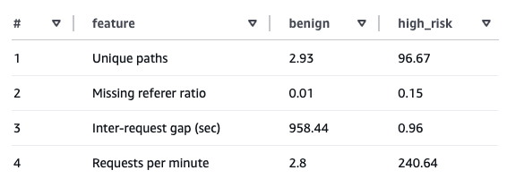
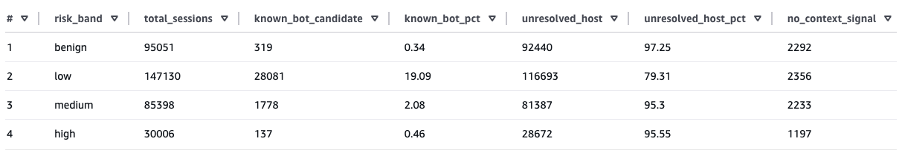
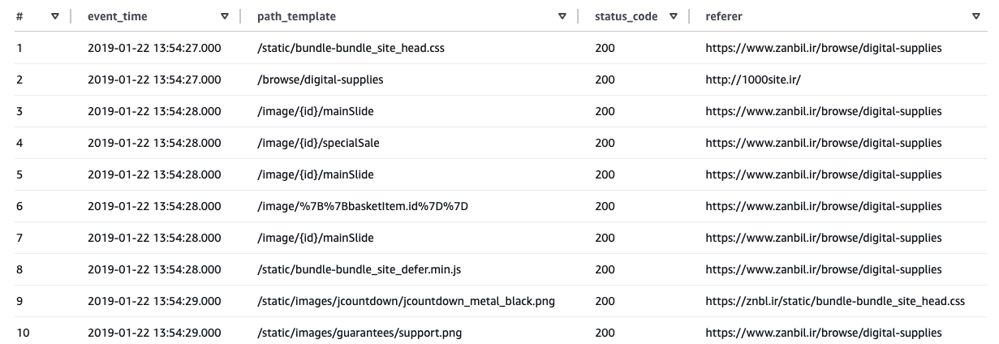
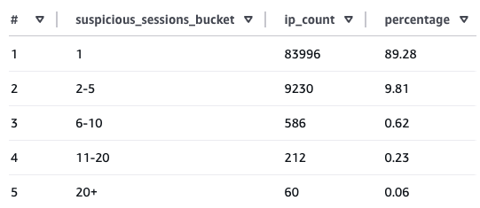

# From Behavior to Interpretation: An Explainable Bot Detection Pipeline

## 1. What this project does
This project builds **a replayable anti-scraping analysis pipelin**e that transforms raw web access logs into explainable, session-level detection outputs.

It identifies suspicious traffic using behavioral signals, while preserving full traceability back to request-level events. 
In addition to detection outputs, the pipeline also produces a reusable session-level feature dataset for downstream analysis and model development.


## 2. Why this problem is hard

Detecting scraping behavior from web logs is challenging because legitimate crawlers and malicious scrapers often exhibit similar behavioral patterns.

Both can generate:

- high request rates  
- systematic navigation across many paths  
- missing referer signals  

As a result, purely behavior-based detection can identify automated traffic, but cannot reliably distinguish between benign and malicious intent.

This challenge is further complicated by the fact that contextual signals such as user-agent strings and hostnames can be spoofed, making it difficult to fully trust identity-based indicators.

This creates a gap between detection and interpretation, where additional context is required to understand whether flagged traffic represents normal crawler activity or potential abuse.


## 3. What this pipeline produces

This pipeline produces two types of data products designed for different consumers.

### 1. Detection product (primary)

The primary output is an explainable detection dataset for analysts and operational monitoring.

It answers:

- Which sessions are suspicious?  
- Why were they flagged?  
- How should they be interpreted?  

The main dataset, `suspicious_sessions`, provides:

- session-level risk scores and risk bands  
- rule-based signals explaining why a session was flagged  
- contextual annotations to aid interpretation  

These outputs enable analysts to investigate suspicious traffic, identify false positives, and distinguish between likely benign crawlers and unknown automation.


### 2. Feature product (secondary)

The pipeline also produces a session-level feature dataset (`session_features`) for downstream analysis and model development.

This dataset provides:

- behavioral signals derived from session activity  
- minimal contextual features  

It serves as a reusable input for:

- training detection models  
- behavioral analysis and experimentation  


## 4. How it works

The pipeline processes raw web access logs through a series of transformations to produce session-level detection outputs.

### Data
The pipeline is built on publicly available web server access logs.

- `access.log`  
  Raw web access logs in Apache combined log format, containing request-level information such as IP, timestamp, request path, status code, referer, and user-agent.  
  The dataset contains approximately 10 million requests across 5 days (2019-01-22 to 2019-01-26).

- `ip_hostname_lookup.csv`  
  A lookup table mapping IP addresses to hostnames, used for lightweight context enrichment.

The access logs serve as the primary input for behavioral analysis, while the hostname mapping provides additional signals for interpreting detected traffic.

### Data flow

[draw.io diagram]

### Layers

- **Raw Logs**  
  Immutable, append-only source of truth for all incoming web traffic.

- **Normalized Events**  
  Request-level records extracted from raw logs, structured and cleaned without applying detection logic.

- **Session Reconstruction**  
  Groups requests into sessions based on `(src_ip, user_agent)` and an inactivity threshold.  
  To ensure correct session boundaries across partitions, the pipeline includes a lookback window from the previous day, allowing sessions that span midnight to be reconstructed accurately.

- **Session Features**  
  Aggregates session-level behavioral signals such as request frequency, navigation patterns, and inter-request timing.

- **Context Enrichment**  
  Adds lightweight contextual signals (e.g., hostname, known crawler indicators) to support interpretation.

- **Detection Outputs**  
  Applies rule-based detection to identify suspicious sessions and generate explainable outputs.

### Validation and Monitoring

To ensure data reliability, the pipeline includes a validation layer applied at each stage of the transformation.

The framework performs checks such as:

- row count consistency between stages  
- grain consistency (ensuring transformations do not unintentionally change row-level granularity)  
- duplicate detection  
- null value checks  
- range and value validation for key features  

These validations are categorized into error-level and warning-level checks.

Error-level validations (e.g., schema violations or critical data inconsistencies) cause the pipeline to fail fast, while warning-level validations allow processing to continue but surface potential issues for inspection.

Malformed or unparseable raw log lines are isolated during the parsing stage through a quarantine mechanism, preventing them from affecting downstream transformations while preserving them for inspection.

In addition, the pipeline collects structured metrics and runtime metadata for each execution.

This includes not only basic execution signals, but also data quality and validation outcomes, such as:

- row counts at each stage of the pipeline  
- distribution of detection results (e.g., risk bands, flagged sessions)  
- validation check results (e.g., duplicate counts, null violations, invalid feature ranges)  
- parsing error statistics and quarantine counts  
- execution metadata (run_id, process_date, duration, status)

Each run produces a consolidated metadata record, enabling traceability, debugging, and monitoring of both pipeline execution and data quality over time.
This metadata can be used to audit pipeline runs and identify data quality regressions across executions.


### Execution model

The pipeline operates as a daily batch system driven by a `process_date`.

Each run processes logs for a given date and produces partitioned outputs, enabling:

- reproducibility  
- backfill and replay  
- isolation between runs  

While logs are assumed to arrive continuously, the current system focuses on offline analysis rather than real-time detection.

The same execution model is used across environments (local and EC2), with configuration-driven behavior.

For local development, the pipeline processes a sampled subset of data to avoid memory constraints, while the EC2 environment runs on the full dataset.


## 5. Results

### 1. How do suspicious sessions differ from normal traffic?



High-risk sessions show significantly higher request rates and near-zero inter-request gaps, indicating machine-like behavior. 

In contrast, benign sessions exhibit lower activity levels and more natural navigation patterns.

### 2. Where do known crawlers appear in the risk spectrum?

Behavioral signals alone can identify automated activity, but do not provide enough information to interpret the nature of that activity.

To address this, the pipeline introduces lightweight context signals derived from two sources:

- hostname lookups (mapping IPs to known domains)  
- user-agent pattern matching for well-known crawlers  

These signals are used to annotate sessions with indicators such as whether they are associated with known crawler infrastructure.



From the distribution, known crawler signals (`known_bot_candidate`) appear most frequently in the low-risk band, while high-risk sessions are largely composed of traffic without resolved host context (`unresolved_host`).

This provides additional context for interpreting flagged sessions, allowing analysts to differentiate between traffic with recognizable crawler signals and traffic without identifiable host information.

Importantly, these context signals do not influence the detection score itself, but serve only as annotations for interpretation.

### 3. What does a suspicious session actually look like?

We examined a high-risk session at the request level.



The session begins with a browse page request and is followed almost immediately by a burst of rapid, consecutive requests.  
Within a very short time window, repeated requests appear across multiple image-related path templates such as `/image/{id}/brand` and `/image/{id}/productModel/...`.

This illustrates how the session-level signals identified earlier (e.g., high request rate and low inter-request gap) correspond to actual request behavior.

More importantly, this demonstrates that detection results can be traced back to the underlying request sequence, allowing analysts to inspect and validate why a session was flagged.

Not all high-risk sessions exhibit the same pattern.  
In another example, the session contains repeated login, basket, and product requests with a high number of failed responses, showing that suspicious traffic can also appear as noisy or unstable interaction patterns rather than clean sequential crawling.

### 4. Is suspicious activity concentrated among a small number of IPs?



The distribution is based on sessions in the medium and high risk bands.

Most IPs generate only a small number of suspicious sessions, while a small subset of IPs are responsible for a disproportionately large share.

This suggests that suspicious activity is not uniformly distributed, and that repeated automated behavior can often be traced to a small set of recurring actors.


## 6. Limitations

### 1. Behavior alone cannot determine intent

The detection logic is based on behavioral signals, which are effective at identifying automated activity but do not capture intent.

As a result, legitimate crawlers and potentially malicious scrapers can exhibit similar patterns, making it difficult to distinguish between them without additional context.

### 2. Context signals are incomplete and potentially unreliable

Context enrichment relies on hostname resolution and user-agent patterns, which are inherently limited.

- Not all IPs can be mapped to known hostnames  
- User-agent strings can be spoofed  
- The lookup dataset may not cover all relevant domains  

This means that context signals provide useful hints, but should not be treated as definitive indicators.


### 3. Parsing efficiency is limited by row-wise Python execution

The current parsing layer applies Python-based logic to each log entry within Spark, prioritizing flexibility for handling raw log formats.

However, this approach introduces additional overhead compared to native Spark SQL transformations, particularly at larger data scales.

While suitable for this use case, further optimization could be achieved by expressing more of the parsing logic using built-in Spark functions to reduce Python execution costs.


## 7. Future Improvements

### 1. Near real-time detection

The current pipeline operates as a daily batch system. However, the architecture can be extended to support near real-time processing by introducing a streaming ingestion layer (e.g., Kafka) and processing shorter time windows.

Since the pipeline already operates on partitioned data, the core data model and transformation logic can be reused with minimal changes for incremental or streaming execution.

### 2. Enhanced context signals

The current context enrichment relies on hostname and user-agent patterns. This can be extended with additional signals such as IP reputation data, ASN information, or historical behavior patterns to improve interpretability.

### 3. Model-based detection

While the current system uses rule-based detection, the session-level feature dataset enables future integration of machine learning models.

These models could capture more complex behavioral patterns and improve detection performance beyond manually defined rules.


## 8. Project Structure

### Project Directory

```aiignore
docs
├── config/                  # Environment-specific configuration
├── docs/                    # Documentation and analysis artifacts
├── jobs/                    # Entry points for each pipeline stage
├── src/
│   ├── parsing/             # Raw log parsing logic
│   ├── sessionization/      # Session reconstruction
│   ├── features/            # Session-level feature engineering
│   ├── enrichment/          # Context signal enrichment
│   ├── detection/           # Rule-based detection logic
│   ├── monitoring/          # Validation, metrics, and manifest
│   └── common/              # Shared utilities and Spark setup
├── tests/                   # Unit tests for core transformations
└── requirements.txt
```

Each pipeline stage is implemented as a modular transformation in `src/`, with corresponding job entry points under `jobs/`, enabling flexible orchestration and stage-level execution.


### Storage Layout

Pipeline outputs are stored in a partitioned layout to support reproducibility and backfill.

```aiignore
anti-scraping/
├── raw_logs/event_date=YYYY-MM-DD/
├── normalized_events/event_date=YYYY-MM-DD/
├── sessionized_events/session_date=YYYY-MM-DD/
├── session_features/session_date=YYYY-MM-DD/
├── session_features_enriched/session_date=YYYY-MM-DD/
├── suspicious_sessions/session_date=YYYY-MM-DD/
├── daily_abuse_summary/event_date=YYYY-MM-DD/
├── quarantined_raw_events/process_date=YYYY-MM-DD/
├── quarantined_raw_lines/          ← no partition 
├── manifests/process_date=YYYY-MM-DD/
└── metrics/process_date=YYYY-MM-DD/
```

Analytical datasets are partitioned by event or session date, enabling efficient filtering and reprocessing at a daily granularity.

In contrast, operational outputs such as manifests, metrics, and aggregated quarantine records are partitioned by process date, reflecting the execution context of each pipeline run.

Quarantine outputs are handled differently depending on their purpose. While aggregated quarantine datasets are partitioned by process date, raw quarantined lines are stored without partitioning to simplify inspection and debugging.

Given the relatively small volume of raw quarantine data in this setting, a non-partitioned layout is sufficient and avoids unnecessary complexity.


## 9. Infrastructure

The pipeline was developed and tested in both local and cloud environments.
The environment was chosen to balance cost and sufficient memory for Spark-based batch processing.

### Compute

- AWS EC2 (Ubuntu 22.04 LTS)
- Instance type: m5.xlarge (4 vCPU, 16 GB RAM, 50 GiB (gp3) EBS)

### Storage

- Amazon S3 for data lake storage
- Partitioned Parquet datasets for analytical outputs

### Processing

- Apache Spark for distributed data processing


## 10. How to Run

#### Prerequisites

- Python 3.13
- Java 11+ (required for Spark)
- Apache Spark (PySpark)

#### Setup (local)

```bash
git clone https://github.com/kngsoomin/anti-scraping-detection-pipeline.git
cd anti-scraping-detection-pipeline

python -m venv .venv
source .venv/bin/activate
pip install -r requirements.txt
mkdir -p data/kaggle
```

Download the dataset from Kaggle and place it at: `data/kaggle/access.log`

#### One-time setup (raw partitioning)
The raw dataset is provided as a single log file.
Before running the pipeline, it must be partitioned into raw_logs/ by date:

```bash
python -m jobs.run_prepare_raw_partitions local # The final argument specifies the environment (e.g., `local` or `ec2`).
```

This step only needs to be executed once.

#### Run the pipeline (local)

Single date:
```bash
python -m jobs.run_pipeline --process-date 2019-01-22 local
```

Date range (backfill):
```bash
python -m jobs.run_pipeline --start-date 2019-01-22 --end-date 2019-01-26 local
```

#### Inspect outputs (local)

```bash
python -m jobs.inspect_outputs --process-date 2019-01-22 local
```

#### Notes

- The local configuration (`config/local.yml`) processes a sampled subset of sessions by default to avoid memory issues. The sample size can be adjusted in the config file if needed.

#### Run the pipeline (EC2)

The same pipeline can be executed on EC2 with minimal changes.

- Upload the raw dataset (`access.log`) to the EC2 instance  
- Configure your S3 bucket for output storage  
- Update `config/ec2.yml` with your environment settings
- Set up ec2 env as you do for local environment

Then run the same commands as above with `ec2` instead of `local`:

```bash
python -m jobs.run_pipeline --process-date 2019-01-22 ec2
```

The processing logic and execution flow remain identical across environments, with raw data read from the local filesystem and outputs written to S3.